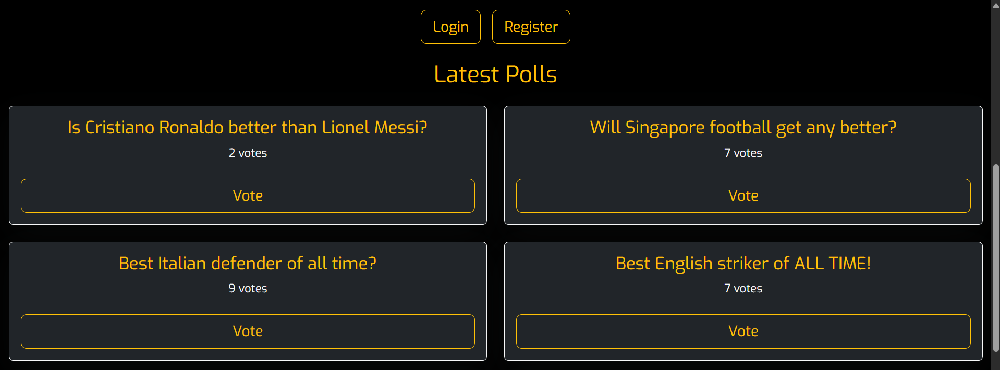
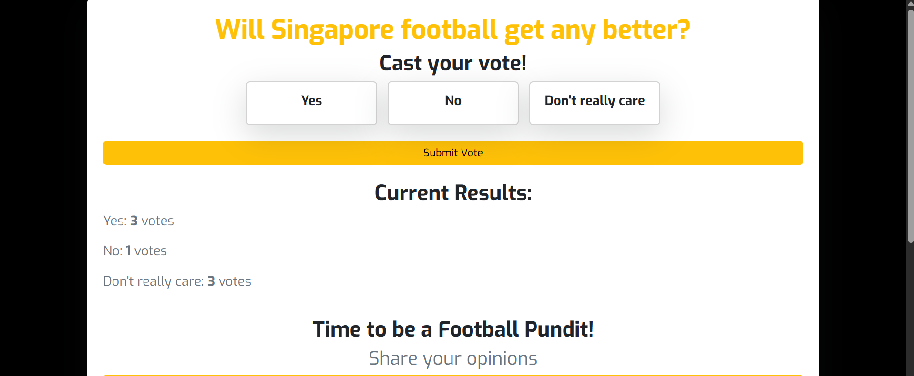
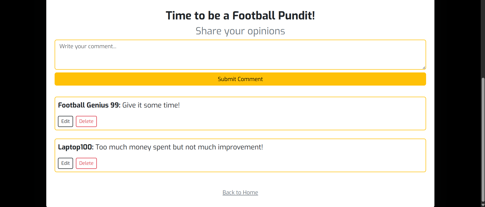
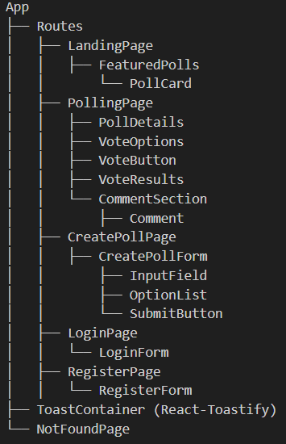

App Name: FootyVote
Description: A PERN full-stack application built for passionate football fans to debate, vote, and shape conversations around key football topics.
The files of this app can be accessed through the following github url: https://github.com/FairuzFairuz/FootyVote

Screenshot of Landing Page_1:

Screenshot of Landing Page_2:

Screenshot of Polling Page_1:

Screenshot of Polling Page_2:

Tech Stack
Frontend: React, Bootstrap and React-Toastify
Backend: Node.js, Express.js, PostgreSQL, JWT Authentication
Development Tools: Github, Bash and Node Terminal

Hierarchy of Components:

Environment Variables(.env)
DATABASE_URL=postgres://<your_username>:<your_password>@<your_host>:<your_port>/<DB_NAME>
ACCESS_SECRET=your_access_token_secret
REFRESH_SECRET=your_refresh_token_secret
PORT:5000

Future Improvements:

- Change visualization of voting results in polling page
- Create polling knockout rounds
- Improve on UI/UX of application by using Figma
